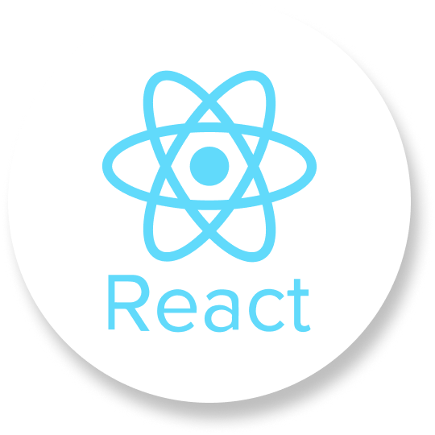
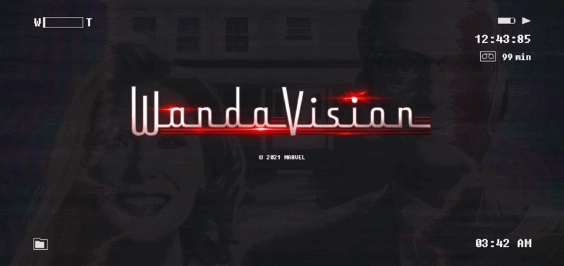

<!-- 로고 이미지 -->

  

<!-- 링크 버튼 -->

  
  

<!-- 프로젝트 기본 정보 -->
<h3 align="center">
  React 기반 SPA 웹 애플리케이션  
  React Router를 활용해 새로고침 없는 페이지 전환을 구현한 프로젝트입니다.
</h3>

<h4 align="center">
  [ React SPA Practice Project | Aug 2025 ]
</h4>

<!-- 내용 -->
## 🛠 Tech Stack

  
  
  
  
  

  
  
  
  
  

## 📺 WandaVision SPA Project

#### React + Swiper + React Router를 활용하여 구현한 완다비전 테마 SPA 프로젝트입니다.    빈티지 TV 콘셉트 UI를 기반으로 캐릭터 정보와 에피소드 가이드를 제공합니다.
- 본 프로젝트는 `React`를 기반으로 한 웹 애플리케이션으로,  
  사용자는 새로고침 없이 페이지를 이동하며 콘텐츠를 탐색할 수 있습니다.  
  특히 `Swiper`와 `ReactPlayer`를 활용해 인터랙티브한 콘텐츠 소비 경험을 제공합니다.

## ✨ Key Features

### 🕒 Dynamic Header UI
* **Dynamic Clock:** `useEffect`와 `Date` 객체를 사용하여 1초마다 갱신되는 AM/PM 실시간 시계 구현.
* **Disk Timer:** 98분에서 시작해 1분마다 감소하는 디스크 잔량 카운트다운 (1분 미만 시 99분으로 리셋).
* **Navigation:** 폴더와 파일 이미지를 레이어링한 독특한 GNB 메뉴 구성.

### 🎬 Trailer Video Player
* **Video Control:** `useState`를 통해 음소거(Mute) 상태와 영상 인덱스를 관리.
* **Loop Navigation:** 첫 번째 영상에서 '이전' 클릭 시 마지막으로, 마지막에서 '다음' 클릭 시 첫 번째로 연결되는 순환 구조.

### 🎭 Character / Episode Slide UI
* **Swiper.js 활용:** `EffectFade` 모듈을 적용하여 부드러운 화면 전환 효과 구현.
* **Data Mapping:** 캐릭터 및 에피소드 데이터를 배열 객체로 관리하고 `map()` 함수를 통해 효율적으로 렌더링.

### 📺 CRT Screen Effect
* **CRT Effect:** TV 노이즈 GIF와 반투명 레이어를 `z-index`로 배치하여 빈티지한 TV 화면 질감 재현.

## 📂 Project Structure

| 분류 | 파일명 | 주요 역할 및 기능 | 핵심 개념 |
| :--- | :--- | :--- | :--- |
| **Main** | `App.js` | 전체 라우팅 및 페이지 구조 정의 | `HashRouter`, `Route` |
| **Global** | `Header.js` | 실시간 시계, 타이머, 네비게이션 메뉴 | `useState`, `useEffect` |
| **Global** | `Common.js` | TV 노이즈 및 화면 오버레이 효과 | `Fixed Positioning` |
| **Page** | `Main.js` | 인트로 배경 및 메인 카피라이트 표시 | `Static Rendering` |
| **Page** | `Trailer.js` | 유튜브 트레일러 플레이어 및 컨트롤러 | `ReactPlayer`, `State` |
| **Page** | `Characters.js`| 캐릭터별 이미지 및 정보 슬라이드 | `Swiper`, `Navigation` |
| **Page** | `Synopsis.js` | 에피소드별 줄거리 및 배경 슬라이드 | `Swiper`, `Loop` |

## 📚 What I Learned
* **SPA의 이해:** `react-router-dom`을 통해 페이지 전환 시 깜빡임 없는 사용자 경험 구현.
* **컴포넌트 생명주기:** `useEffect`를 활용한 타이머 구현 및 메모리 누수 방지(Cleanup).
* **CSS 레이어링:** `position: absolute/fixed`와 `z-index`를 활용한 복잡한 배경 디자인 제어.
* **데이터 주도 렌더링:** UI와 데이터를 분리하여 유지보수가 용이한 코드 작성.

  

